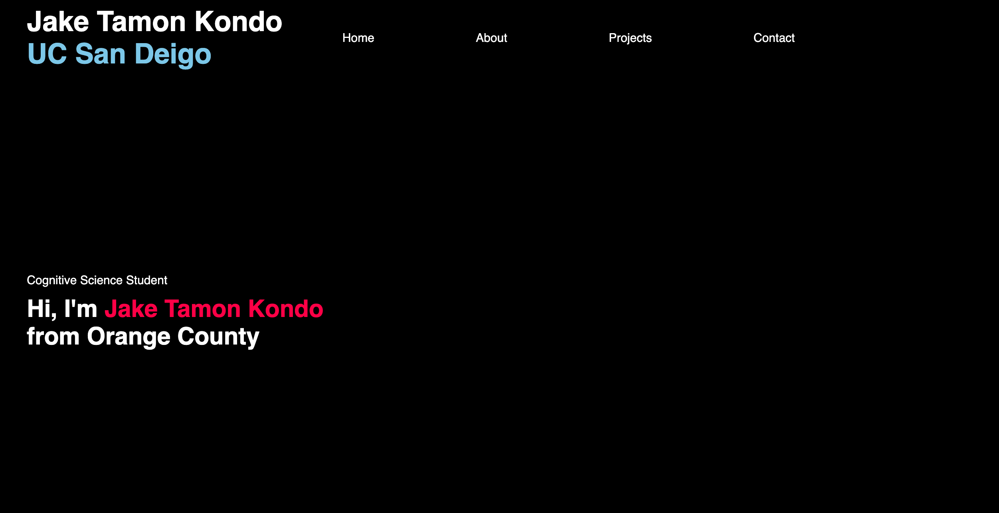
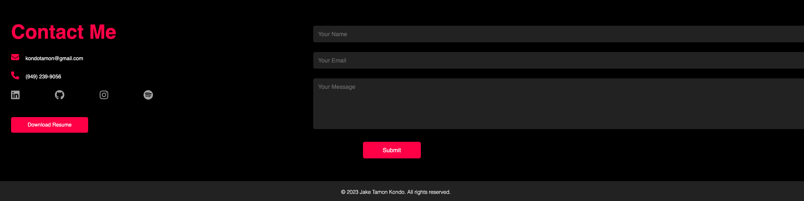

# Jake Kondo's Portfolio
Jake Kondo's personal portfolio

Using HTML, CSS, and a little bit of JavaScript I created a personal portfolio for myself!

The portfolio has buttons such as a download for my resume and different headers that link to the different sections of the portfolio. In the About Me Section, the three subheaders Skills, Education, and Experience can be clicked to display the current subheader and hide the other subheader.

These are the screenshots of the Portfolio

